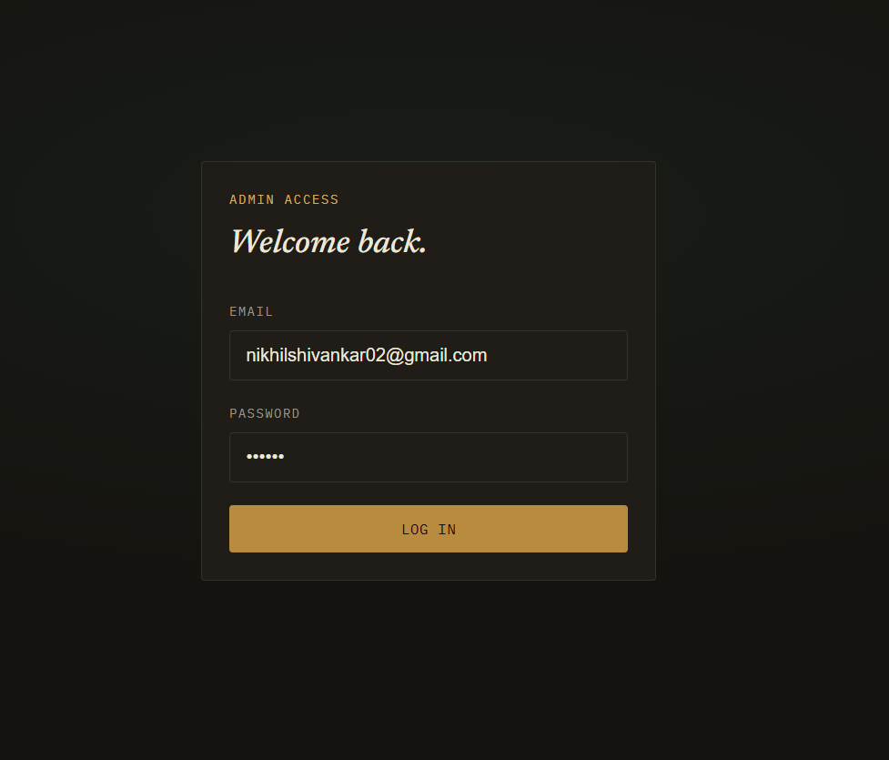
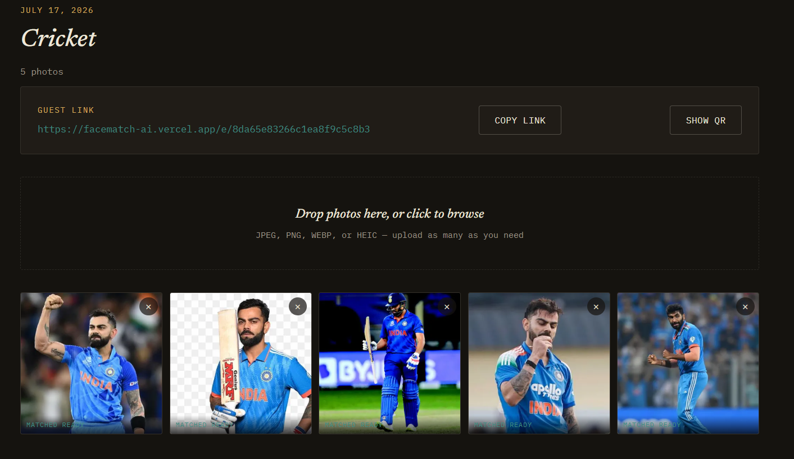
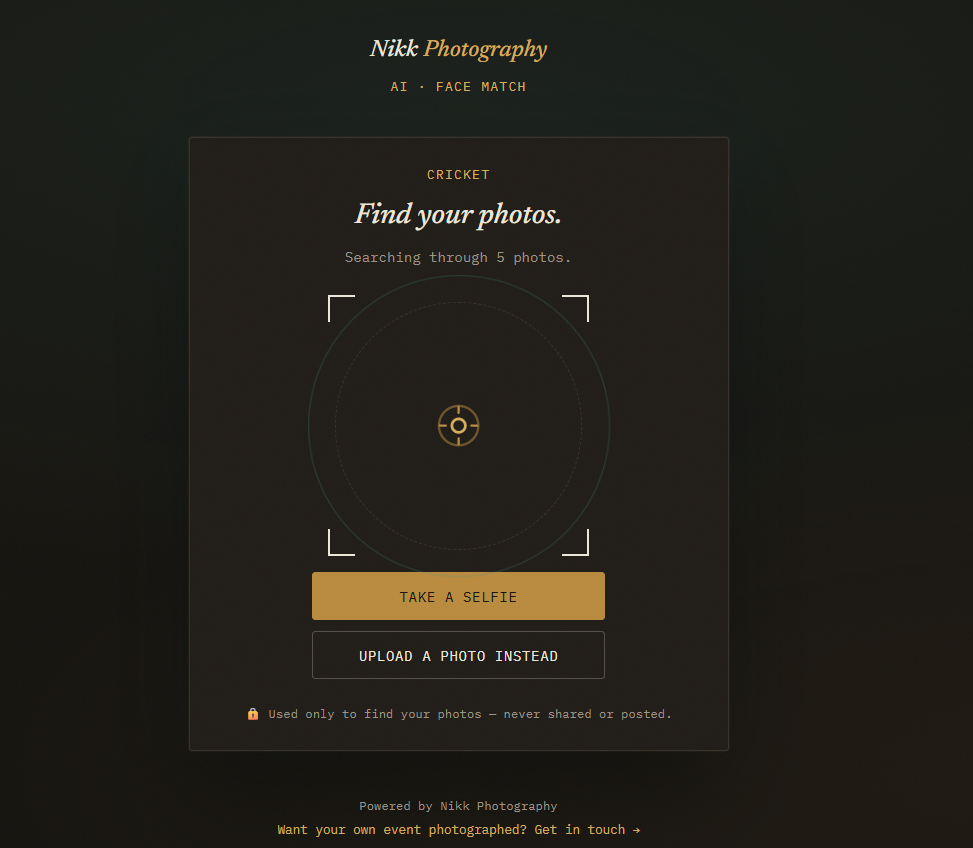
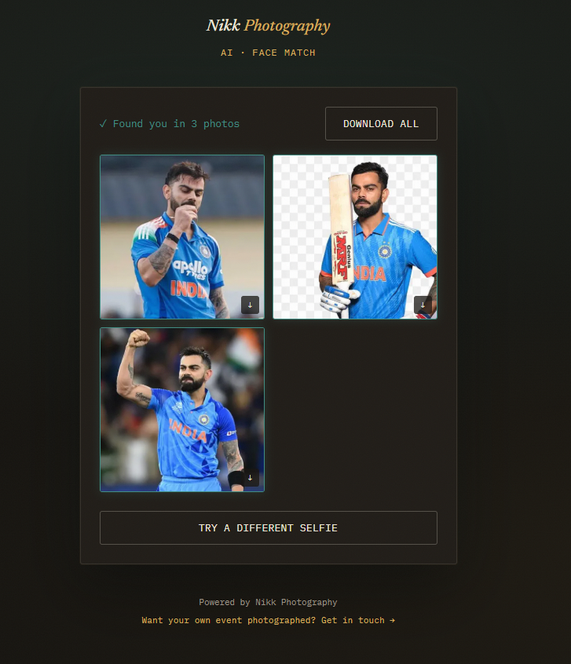

<div align="center">

# 📸 FaceMatch AI - AI Event Photo Delivery Platform

**AI-powered event photo delivery — guests find their own photos instantly, using face recognition.**

[](https://react.dev/)
[](https://nodejs.org/)
[](https://fastapi.tiangolo.com/)
[](https://www.mongodb.com/atlas)
[](#-deployment)


[Live Demo](#-live-demo) · [Features](#-features) · [Tech Stack](#%EF%B8%8F-tech-stack) · [Setup](#-getting-started) · [API Docs](#-api-reference) · [Architecture](#-architecture)

</div>

---

## 📖 Overview

**FaceMatch AI** is a full-stack event photography platform that eliminates manual photo sorting. Photographers bulk-upload event photos to a central gallery; guests then find and download **only their own photos** by taking a selfie, powered by a dedicated face-recognition microservice.

Built as a complete, deployed product — not a prototype — with a live admin dashboard, a public guest flow, and a production AI pipeline running across three coordinated services.

---

## 🔗 Live Demo

| Service | URL |
|---|---|
| 🖥️ Web App | [facematch-ai.vercel.app](https://facematch-ai.vercel.app) |
| ⚙️ Backend API | [facematch-backend.onrender.com/api/health](https://facematch-backend.onrender.com/api/health) |
| 🤖 AI Service | [facematch-ai-service.onrender.com/health](https://facematch-ai-service.onrender.com/health) |

**Try it yourself:** Log into the admin dashboard → create an event → upload a few photos of yourself → open the generated guest link in an incognito window → test the selfie match.

> ⏳ **Note:** The backend and AI service run on Render's free tier and spin down after 15 minutes of inactivity. The first request after idle time may take 30–60 seconds to wake up — this is expected.

---

## ✨ Features

- 🔐 **Secure admin authentication** with JWT + bcrypt
- 🗂️ **Event management** — create, update, and delete photo events
- 📤 **Bulk photo uploads** to Cloudinary with automatic thumbnail generation
- 🧠 **AI face detection & embedding pipeline** built with `dlib` / `face_recognition`
- 🤳 **Selfie-based guest matching** — guests find their photos without browsing the full gallery
- 📱 **QR code generation** for quick guest access to event galleries
- 📦 **One-tap "Download All"** as a ZIP for guests with multiple matches
- 🧹 **Cascade delete** — removing an event cleans up all associated photos
- 🌐 **Fully deployed** production system (Vercel + Render + MongoDB Atlas + Cloudinary)

---

## 🖼️ Screenshots

<div align="center">

| Admin Dashboard | Event Detail + QR Code |
|:---:|:---:|
|  |  |

| Guest Selfie Match | Matched Photos Gallery |
|:---:|:---:|
|  |  |

</div>


---

## 🏗️ Architecture

```
┌─────────────────┐        ┌──────────────────┐        ┌───────────────────────┐
│   React (Vite)   │  HTTP  │  Node / Express   │  HTTP  │   Python / FastAPI     │
│   Frontend       │───────▶│  Backend API      │───────▶│   AI Service           │
│   (Vercel)       │◀───────│  (Render)         │◀───────│   (Render)             │
└─────────────────┘        └──────────┬────────┘        └───────────┬───────────┘
                                       │                              │
                                       ▼                              ▼
                            ┌──────────────────┐          ┌────────────────────┐
                            │  MongoDB Atlas    │          │  dlib /             │
                            │  (events, users,  │          │  face_recognition   │
                            │   photo metadata) │          │  (embeddings,       │
                            └──────────────────┘          │   blur score)       │
                                       │                   └────────────────────┘
                                       ▼
                            ┌──────────────────┐
                            │   Cloudinary       │
                            │  (photo storage)   │
                            └──────────────────┘
```

**Flow:** Admin uploads photos → Backend stores metadata in MongoDB and files in Cloudinary → AI service detects faces and generates embeddings → Guest submits a selfie → AI service compares embeddings → Matched photos are returned to the guest.

---

## ⚙️ Tech Stack

| Layer | Technology |
|---|---|
| Frontend | React (Vite) |
| Backend API | Node.js, Express.js |
| AI / Face Recognition | Python, FastAPI, `dlib`, `face_recognition` |
| Database | MongoDB Atlas |
| File Storage | Cloudinary |
| Authentication | JWT + bcrypt |
| Frontend Hosting | Vercel |
| Backend & AI Hosting | Render |

---

## 📁 Project Structure

```
facematch-ai/
├── backend/                 # Node.js / Express API
│   └── src/
│       ├── config/          # DB connection, admin seeding
│       ├── routes/          # Auth, events, photos
│       └── ...
├── frontend/                 # React (Vite) app
│   └── src/
│       ├── api/client.js     # Axios instance, JWT handling, 401s
│       ├── context/AuthContext.jsx
│       ├── components/       # ProtectedRoute, AdminNav, EventCard, PhotoGrid, PhotoUploader, CreateEventForm
│       ├── pages/            # Login, Dashboard, EventDetail
│       └── index.css         # Design tokens (brass/teal/ink palette, type scale)
└── ai-service/                # Python / FastAPI face recognition service
    └── app/
        └── main.py
```

---

## 🚀 Getting Started

Three services run simultaneously for full local functionality: **AI service → Backend → Frontend**.

<details>
<summary><strong>1️⃣ AI Service (Python / FastAPI)</strong></summary>

> Requires **Python 3.11** specifically — `dlib` / `face_recognition` are not reliably compatible with Python 3.13+. Install 3.11 alongside your existing version if needed.

```bash
cd ai-service

# Create a virtual environment with Python 3.11
py -3.11 -m venv venv

# Activate (Windows Git Bash)
source venv/Scripts/activate

# Install dependencies
pip install -r requirements.txt

# Run the service
uvicorn app.main:app --reload --port 8000
```

Verify it's running: `curl http://localhost:8000/health`

**Troubleshooting `dlib`:** If installation fails while building `dlib`, install **CMake** and **Visual Studio Build Tools (C++ workload)** first — this is a known friction point on Windows, not a bug in this project.

</details>

<details>
<summary><strong>2️⃣ Backend (Node.js / Express)</strong></summary>

```bash
cd backend
npm install
cp .env.example .env
# Edit .env: set MONGO_URI, JWT_SECRET, and AI_SERVICE_URL=http://localhost:8000

# Create your admin account (edit constants in the file first)
node src/config/seedAdmin.js

npm run dev
```

Runs on `http://localhost:5000` — Health check: `GET /api/health`

</details>

<details>
<summary><strong>3️⃣ Frontend (React / Vite)</strong></summary>

```bash
cd frontend
npm install
cp .env.example .env
# Edit .env if the backend runs on a URL other than localhost:5000

npm run dev
```

Runs on `http://localhost:5173`. Requires the backend to be running — there is no mock data.

- Admin dashboard: `http://localhost:5173`
- Guest flow: `http://localhost:5173/e/<shareSlug>` (get the live link + QR code from any event's detail page)

</details>

---

## 📡 API Reference

### Backend API (`/api`)

| Method | Route | Auth | Description |
|---|---|:---:|---|
| POST | `/api/auth/login` | ❌ | Admin login |
| GET | `/api/auth/me` | ✅ | Get current admin profile |
| POST | `/api/events` | ✅ | Create event |
| GET | `/api/events` | ✅ | List all events |
| GET | `/api/events/:id` | ✅ | Get a single event |
| PATCH | `/api/events/:id` | ✅ | Update event |
| DELETE | `/api/events/:id` | ✅ | Delete event (and its photos) |
| POST | `/api/events/:eventId/photos` | ✅ | Bulk upload photos (`multipart/form-data`, field: `photos`) |
| GET | `/api/events/:eventId/photos` | ✅ | List photos for an event |
| DELETE | `/api/events/:eventId/photos/:photoId` | ✅ | Delete a single photo |

### AI Service

| Method | Route | Description |
|---|---|---|
| GET | `/health` | Health check |
| POST | `/detect-faces` | Detects faces in an uploaded photo; returns embeddings + blur score |
| POST | `/match-selfie` | Compares a guest selfie against event face embeddings |

---

## 🧠 Architecture Decisions

- **Separate Python microservice for AI**, not a Node ML library — Python's ML ecosystem (`dlib`, `opencv`) is the right tool for the job, and an independent service can be scaled or swapped (e.g. for InsightFace) without touching the rest of the app.
- **No background job queue yet** — photo processing runs as a fire-and-forget async call after upload. This avoids adding Redis as an operational dependency before it's actually needed, with the tradeoff of no automatic retry on server restart.
- **`dlib-bin` instead of `dlib` in production** — the standard `dlib` package has no prebuilt Linux wheels, causing source builds that exceeded Render's free-tier memory. Switching to `dlib-bin` (prebuilt binaries) with `--no-deps` resolved this.
- **Images downscaled before face detection** — full-resolution phone photos (12MP+) caused memory crashes on a constrained host. Resizing to a 1600px max dimension fixed this with no meaningful accuracy loss.
- **Automatic retry for AI service calls** — Render's free tier can return a 502 during cold start before the service finishes booting. `aiClient.js` retries connection failures and 502/503/504s automatically, so cold starts recover without manual intervention.

---

## ⚠️ Known Limitations

**Blur detection is computed but not currently used to filter results.** Each photo's blur score (`isBlurry` / `blurScore`) is calculated via Laplacian variance and stored, but the threshold proved miscalibrated for portrait photography — smooth skin and bokeh backgrounds naturally register as low-variance, causing sharp, correctly matched photos to be filtered out. Rather than ship a filter that degraded results, it was disabled while the score continues to be collected for future use (e.g. an admin-facing "possibly blurry" indicator). Recalibration requires testing against a larger, more varied dataset of real event photos.

---

## 🌍 Deployment

| Component | Platform |
|---|---|
| Frontend | Vercel |
| Backend API | Render |
| AI Service | Render |
| Database | MongoDB Atlas |
| File Storage | Cloudinary |

---

## 🛣️ Roadmap

- [ ] Favorites (guests marking specific photos)
- [ ] Admin analytics dashboard (views/downloads per event)
- [ ] Recalibrated, better-tested blur detection
- [ ] Background job queue (BullMQ/Redis) for production-grade reliability
- [ ] Multi-event face search — intentionally deferred; requires a proper consent/deletion design due to privacy sensitivity
- [ ] AI best-shot selection
- [ ] Duplicate photo detection
- [ ] Premium edited photo galleries
- [ ] Mobile app

---

## 🤝 Contributing

Contributions, issues, and feature requests are welcome.

1. Fork the repository
2. Create your feature branch (`git checkout -b feature/your-feature`)
3. Commit your changes (`git commit -m 'Add your feature'`)
4. Push to the branch (`git push origin feature/your-feature`)
5. Open a Pull Request

---

<div align="center">

Built with ❤️ by **[Nikhil Shivankar]**

</div>
